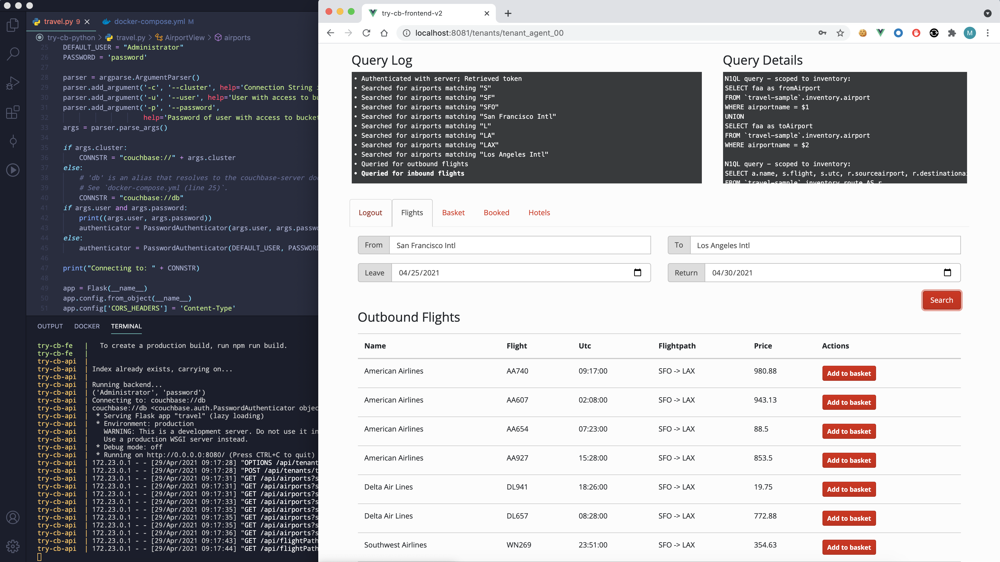

_For Couchbase Server 5.0 see [this branch](https://github.com/couchbaselabs/try-cb-python/tree/5.0) for latest changes to authentication_

# Couchbase Python travel-sample Application REST Backend
This is a sample application for getting started with Couchbase Server and the Python SDK. 
The application runs a single page web UI for demonstrating SQL for Documents (N1QL), Sub-document requests and Full Text Search (FTS) querying capabilities. 
It uses Couchbase Server together with the Python Flask web platform, Angular2 and Bootstrap.

The application is a flight planner that allows the user to search for and select a flight route (including the return flight) based on airports and dates. 
Airport selection is done dynamically using an angular autocomplete box bound to N1QL queries on the server side. After selecting a date, it then searches 
for applicable air flight routes from a previously populated database. An additional page allows users to search for Hotels using less structured keywords.



## Prerequisites
The following pieces need to be in place in order to run the application.

* Couchbase Server 4.5 or later with the travel-sample bucket setup
* Couchbase C Library - [libcouchbase](https://developer.couchbase.com/documentation/server/current/sdk/c/start-using-sdk.html)
* Full text search index on travel-sample bucket called 'hotels'
* Python 2.7 or greater

## Running the application
To download the application you can either download [the archive](https://github.com/couchbaselabs/try-cb-python/archive/master.zip) or clone the repository:

```
$ git clone https://github.com/couchbaselabs/try-cb-python.git
```

The application uses several Python libraries that need to be installed, this are listed in _requirements.txt_ and can be automatically loaded using the _pip_ command:
```
$ pip install -r requirements.txt
```

Launch the application by running the _travel.py_ file from a terminal.
It will tell you the port on _localhost_ to goto in your web browser:

```
$ python travel.py
 * Running on http://localhost:8080/ (Press CTRL+C to quit)
```

To end the application press CONTROL+C in the terminal.

## Configuration Options

By default the application will connect to the Couchbase Server on http://localhost:8091 and use the _travel-sample_ bucket. 
It will however separate user account data into the _default_ bucket.  These options can be modified in `travel.py`.
