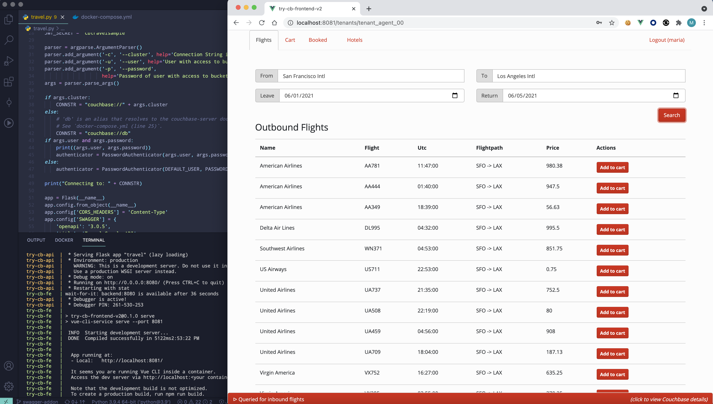

# Couchbase Python travel-sample Application REST Backend

This is a sample application for getting started with [Couchbase Server] and the Python SDK.
The application runs a single page web UI for demonstrating SQL++ for Documents, Sub-document requests and Full-Text Search (FTS) querying capabilities.
It uses Couchbase Server together with the [Flask] web framework for [Python], [Swagger] for API documentation, [Vue] and [Bootstrap].

The application is a flight planner that allows the user to search for and buy flight routes based on airports and dates.
Airport selection happens dynamically using an autocomplete box bound to SQL++ queries on the server side. After selecting a date, it searches
for applicable air flight routes from a populated database. An additional page allows users to search for Hotels using less structured keywords.



## Prerequisites

To download the application you can either download [the archive](https://github.com/couchbaselabs/try-cb-python/archive/master.zip) or clone the repository:

    git clone https://github.com/couchbaselabs/try-cb-python.git

You can run the application with Docker, which starts all components for you.
You can also run it in a Mix-and-Match style, described [here](#mix-and-match-services).


## Running the Application with Docker

You need [Docker](https://docs.docker.com/get-docker/) installed on your machine to run this application. 
A provided [_Dockerfile_](Dockerfile) and a [_docker-compose.yml_](docker-compose.yml) run Couchbase Server 7.x, the front-end [Vue application](https://github.com/couchbaselabs/try-cb-frontend-v2.git) and the Python REST API.

To launch the full application, run this command from a terminal:

    docker compose --profile server up

> **_NOTE:_** You may need more than the default RAM to run the images.
Couchbase have tested the travel-sample apps with 4.5 GB RAM configured in Docker's Preferences -> Resources -> Memory.
When you run the application for the first time, it pulls/builds the relevant Docker images, so it may take some time.

This starts the backend, Couchbase Server 7.x and the Vue frontend app.

You can find the backend API at http://localhost:8080/, the UI at
http://localhost:8081/ and Couchbase Server at http://localhost:8091/

You should then be able to browse the UI, search for airports and get flight route information.

To end the application press <kbd>Control</kbd>+<kbd>C</kbd> in the terminal
and wait for `docker-compose` to stop your containers.

Running the application with the `server` profile pulls an image containing a prebuilt version of the backend. If you want to make changes to the backend, you can run the application with the `local` profile, detailed [here](#editing-the-backend). 

## Run the Database in Capella

To run the database in Couchbase Capella, the invocation is as straight-forward, but there are more setup steps:

### Create the Capella Cluster

First, [sign up for a Capella account](https://docs.couchbase.com/cloud/get-started/get-started.html) and deploy a cluster.

The travel application uses the `travel-sample` data bucket, which the cluster imports by default. To verify this, go to **Data Tools > Buckets**. You should see the `travel-sample` bucket with around 63k items.

If the bucket isn't present, you can import it manually. See [Import](https://docs.couchbase.com/cloud/clusters/data-service/import-data-documents.html) for information about how to import the `travel-sample` bucket.

### Create the Search Index

1. Go to **Data Tools > Search > Create Search Index**
2. Click **Import from File**
3. Navigate to the try-cb-python directory, and select `fts-hotels-index.json`
4. Click **Create Index**

If you can't use the filesystem with the backend, you can copy + paste the index definition from [this repository](https://raw.githubusercontent.com/couchbaselabs/try-cb-python/HEAD/fts-hotels-index.json) into the **Index Definition** field.

### Create the Database Access

Create the credentials to log in **Settings > Database Access > Create Database Access**

* Access Name: cbdemo
* Secret: Password123!
* Bucket: travel-sample
* Scopes: All Scopes
* Access: read/write

Click **Create Database Access** to save your access credentials.

### Allow Your IP

Go to **Settings > Allowed IP Ranges > Add Allowed IP**.

Enter the IP of the system you will be running the application on in the *Allowed IP* field. If this system is the same one you are accessing the Capella UI on, you can click **Add Current IP Address**.

Click **Add Allowed IP** to add the IP address.

### Copy the Connection String

From the **Connect** tab, copy your cluster's connection string, which looks something like:

```
couchbases://cb.dmt-i0huhchusg9g.cloud.couchbase.com
```

### Start the Backend and Frontend

Run the following command to start the application.

```
CB_HOST={your-connection-string} docker-compose --profile capella up
```

You only need to set the `CB_HOST` variable to point the backend to your database.
If you chose a different username and password than the demo ones, then you also need to set these.

```
$ CB_HOST={your-connection-string}
$ CB_USER={your-username}
$ CB_PSWD={your-password}

docker compose --profile capella up
```
## Mix and Match Services

Instead of running all services, you can start any combination of `backend`,
`frontend`, `db` via Docker, and take responsibility for starting the other
services yourself.

As the provided `docker-compose.yml` establishes dependencies between the services,
to make startup as smooth and automatic as possible, there is also an
alternative `mix-and-match.yml`.


### Bring Your Own Database

To run this application against your own configuration of Couchbase
Server, you need version 7.0.0 or later with the `travel-sample`
bucket setup.

> **_NOTE:_** If you aren't using Docker to start Couchbase Server, or you aren't using the
> provided wrapper `wait-for-couchbase.sh`, you need to create a full-text
> Search index on travel-sample bucket called 'hotels-index'. You can do this
> with the following command:

    curl --fail -s -u <username>:<password> -X PUT \
            http://<host>:8094/api/index/hotels-index \
            -H 'cache-control: no-cache' \
            -H 'content-type: application/json' \
            -d @fts-hotels-index.json

With a running Couchbase Server, you can pass the database details in:

    CB_HOST=10.144.211.101 CB_USER=Administrator CB_PSWD=password docker compose -f mix-and-match.yml up backend frontend

The Docker image runs the same checks as usual, and also creates the
`hotels-index` if it doesn't already exist.


### Running the Python API Application Manually

You may want to run the backend one your local machine.
You can still use Docker to run the Database and Frontend components if desired.

> **_NOTE:_** See above for specific details on running your database in Couchbase Capella.

1. Make sure you have `Python 3.7` or later installed on your machine.
2. Install the project dependencies by running:
   `pip install -r requirements.txt`
3. Start the database:
   `docker compose -f mix-and-match.yml up -d db`
   `export CB_HOST=localhost CB_USER=Administrator CB_PSWD=password`
   `./wait-for-couchbase.sh echo Couchbase is ready!`
   The `wait-for-couchbase` wrapper waits until the database has started, and loaded the sample data and indexes.
   If the database is already running, you can skip this step
4. Start the backend:
   `python3 travel.py -c $CB_HOST -u $CB_USER -p $CB_PSWD`
5. Start the frontend:
   `docker-compose -f mix-and-match.yml up frontend`

### Running the Frontend Manually

To run the frontend components manually without Docker, follow the guide
[here](https://github.com/couchbaselabs/try-cb-frontend-v2)

## Editing the Backend

You may want to make changes to the backend, without running it manually. Couchbase have provided a profile in the `docker-compose.yml` to run the backend mounted on the code in this directory. This allows you to make changes to the backend code, and see it instantly reflected in the container.

To start the application in this mode, run the command:

    docker compose --profile server-local up

If your database is running in Capella, run this command instead:

    $ CB_HOST={your-connection-string}
    $ CB_USER={your-username}
    $ CB_PSWD={your-password}

    docker compose --profile capella-local up

You still need to complete all the [setup steps](#run-the-database-in-capella).

> **_NOTE:_** As this mode does not use a prebuilt image, you may encounter dependency issues when building the backend image. 


## REST API Reference and Tests

All the travel-sample apps conform to the same interface, which means that the same database configuration and Vue.js frontend can use any backend.

You can find the Swagger/OpenApi version 3 documentation on the backend at `http://localhost:8080/apidocs` once you've started the application.

You can also view a read-only version at https://docs.couchbase.com/python-sdk/current/hello-world/sample-application.html#

To further verify that every application conforms to the API, there is a [test suite][try-cb-test], which you can run with the command:

```
docker-compose --profile test up test
```

If you are running locally, and want to extend or modify the travel-sample application, you can make changes to both the code and the tests in parallel:

 * Start the backend server locally, for example using "Running the Python API Application Manually" above.
 * Check out the [test suite][try-cb-test] repository in a separate working directory, and run the tests manually, as per the instructions.


[Couchbase Server]: https://www.couchbase.com/
[Python SDK]: https://docs.couchbase.com/python-sdk/current/hello-world/overview.html
[Flask]: https://flask.palletsprojects.com/
[Python]: https://www.python.org/
[Swagger]: https://swagger.io/resources/open-api/
[Vue]: https://vuejs.org/
[Bootstrap]: https://getbootstrap.com/
[try-cb-test]: https://github.com/couchbaselabs/try-cb-test/